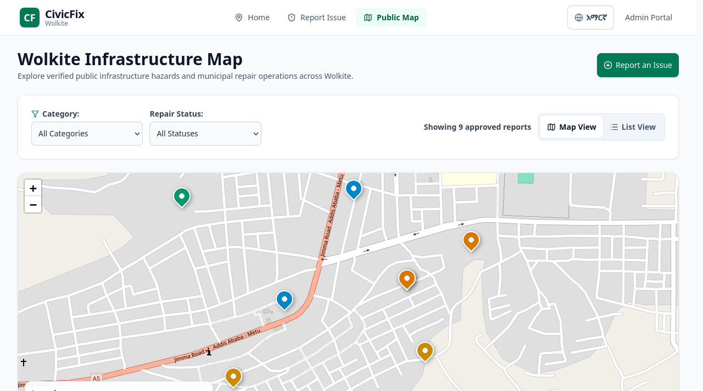
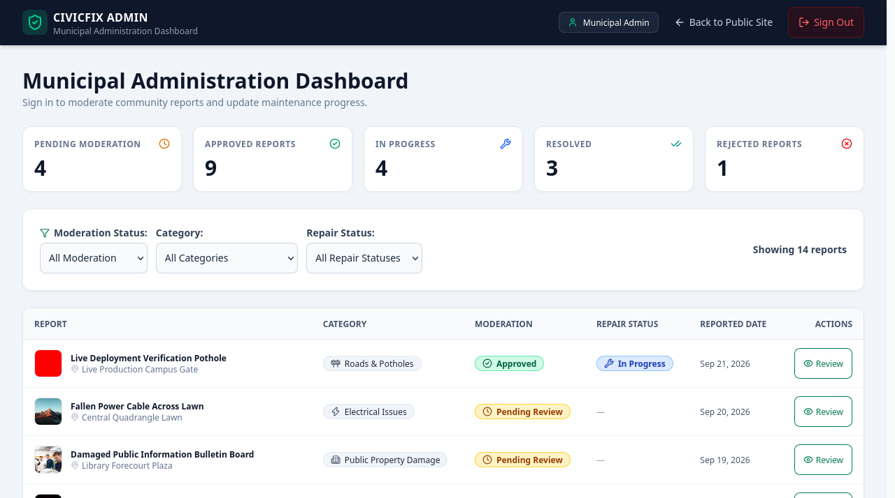
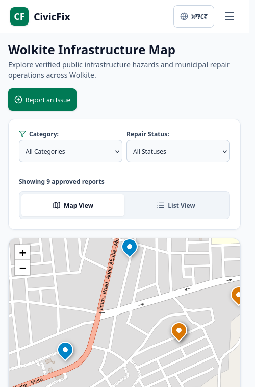
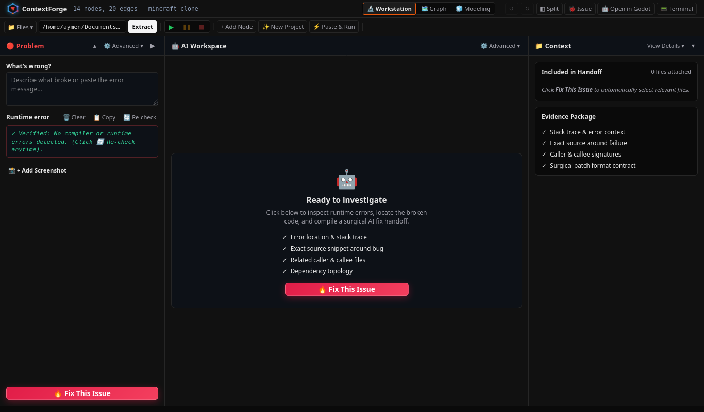
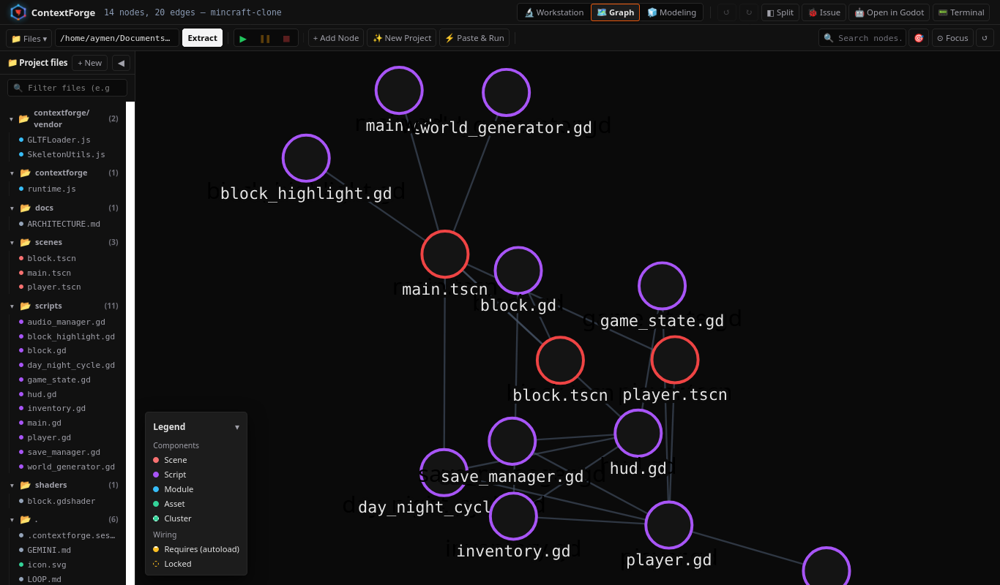
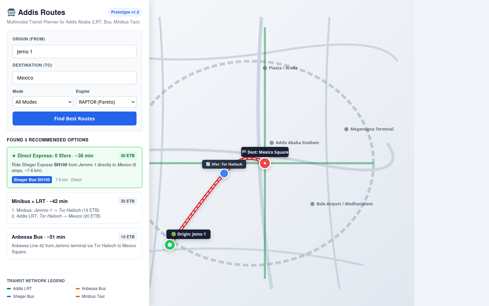

# Aymen Hayder

**Game Developer & AI Tooling Engineer** — Addis Ababa, Ethiopia 🇪🇹

I build gacha RPGs across Unity, Godot and Three.js, and I build the developer
tools I wish existed when I was working on them.

---

## 🗺️ CivicFix — Infrastructure reporting for Wolkite

Full-stack platform where residents report potholes, burst pipes and electrical
hazards with photo + GPS evidence. Bilingual English/አማርኛ, no account needed to
report. Municipal staff moderate and track repairs.

**Live:** frontend on Render, API on Render, MongoDB Atlas — all three connected.

Live production map — verified hazards across Wolkite, filterable by category and repair status.

  
  
  

**Stack:** React · Express · MongoDB Atlas · Leaflet · JWT · Cloudinary · Jest (**118/118 passing**)

<table>
<tr>
<td width="50%"></td>
<td width="50%"></td>
</tr>
<tr>
<td align="center">Admin moderation dashboard</td>
<td align="center">Mobile reporting (390px)</td>
</tr>
</table>

---

## 🧠 ContextForge — AI debugging workbench

Local workbench between your game engine and an external AI chat. It extracts the
real dependency graph from your source (Godot AST + JS module trees), slices out
only the failing function plus the contracts of files that touch it, then applies
the AI's reply back to disk as a validated patch with a 20-step undo history.

The 3-pane workstation — problem capture, AI handoff, and the evidence package assembled for the model.

  

Extracted dependency graph — scene, script and module nodes pulled from real source files, not guessed.

**Stack:** Node.js · Godot 4 · Three.js · Express · **29 server test suites**

---

## 🚌 Addis Routes — Transit routing for Addis Ababa

RAPTOR routing engine over the city's GTFS feed, modelling minibus taxis,
Anbessa buses, Sheger express and the LRT. Returns Pareto-optimal itineraries
with official AACTB distance-banded fares.

Jemo → Mexico — three ranked options with official fares, from direct express to bus+LRT transfer.

  

**Stack:** Python · RAPTOR · GTFS · MapLibre GL JS · OpenFreeMap

---

## 🎮 Games

| Project | What it is |
|---|---|
| **[Zomia](https://github.com/aymenhayderhtml-pixel/Zomia)** | Third-person zombie wave shooter — Godot 4.7. SpringArm camera, hitscan gunplay, navigation-mesh AI, wave spawner. |
| **[Dungeon & Stone](https://github.com/aymenhayderhtml-pixel/mmorpg-prototype-1)** | Offline RPG — Godot 4. Deterministic 600ms tick combat, OSRS-style interface, 5 playable species. |
| **[Pick Me Up: Infinite Gacha](https://github.com/aymenhayderhtml-pixel/pick-me-up-unity-v5)** | One gacha RPG rebuilt across engines to compare how each handles summoning, rosters and endless tower progression. |

### Same game, different engines

| Engine | Repo | Focus |
|---|---|---|
| Unity 6 | [pick-me-up-unity-v5](https://github.com/aymenhayderhtml-pixel/pick-me-up-unity-v5) | Mobile 2D gacha RPG, service-registry DI |
| Three.js | [pick-me-up-web-three-js](https://github.com/aymenhayderhtml-pixel/pick-me-up-web-three-js) | Browser 3D, strict core/UI separation |
| Vanilla JS | [pick-me-up-web-tower](https://github.com/aymenhayderhtml-pixel/pick-me-up-web-tower) | Zero dependencies, no build step |

> The Godot build of this project is in progress and not public yet.

---

## 🛠 Tools & language projects

- **[three-glut](https://github.com/aymenhayderhtml-pixel/three-glut)** — browser scene editor in React + Three.js with GLUT C++ export
- **[asset-forge-v1](https://github.com/aymenhayderhtml-pixel/asset-forge-v1)** — Electron app for generating layered 2D pixel-art sprites
- **[smart-amharic-predictive-keyboard](https://github.com/aymenhayderhtml-pixel/smart-amharic-predictive-keyboard)** — N-gram + Bi-LSTM next-word prediction for faster አማርኛ typing
- **[English-to-Amharic-Translator](https://github.com/aymenhayderhtml-pixel/English-to-Amharic-Translator)** — Android app translating English into Amharic offline

## 🔧 What I work with

**Engines** — Unity 6 · Godot 4 · Three.js
**Languages** — C# · GDScript · TypeScript · JavaScript · Python · Kotlin
**Backend** — Node/Express · FastAPI · MongoDB · PostgreSQL/Supabase · JWT
**Machine learning** — N-gram + Bi-LSTM for Amharic predictive text

---

Building from Addis Ababa 🇪🇹

